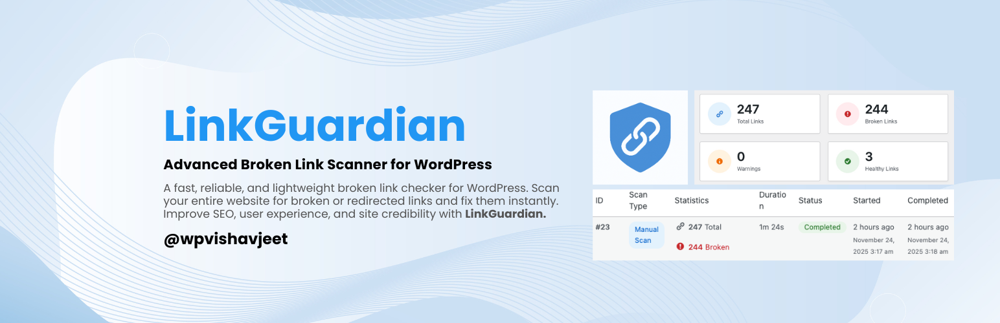
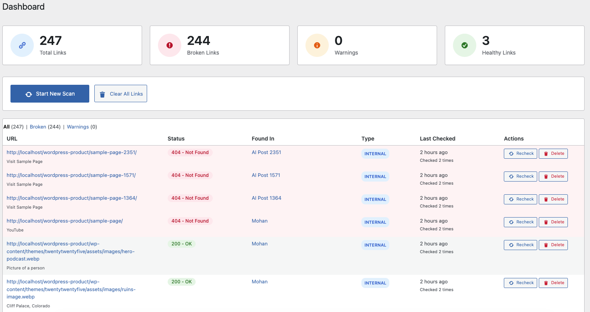
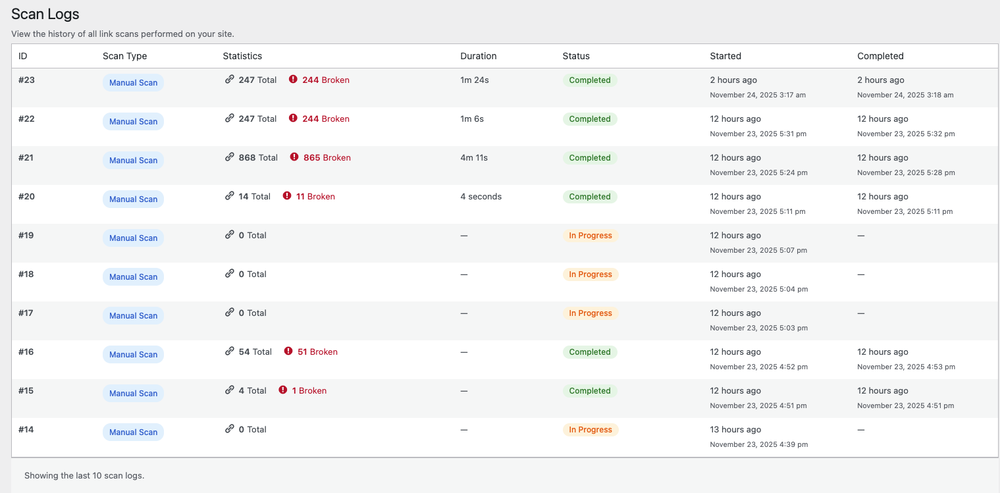
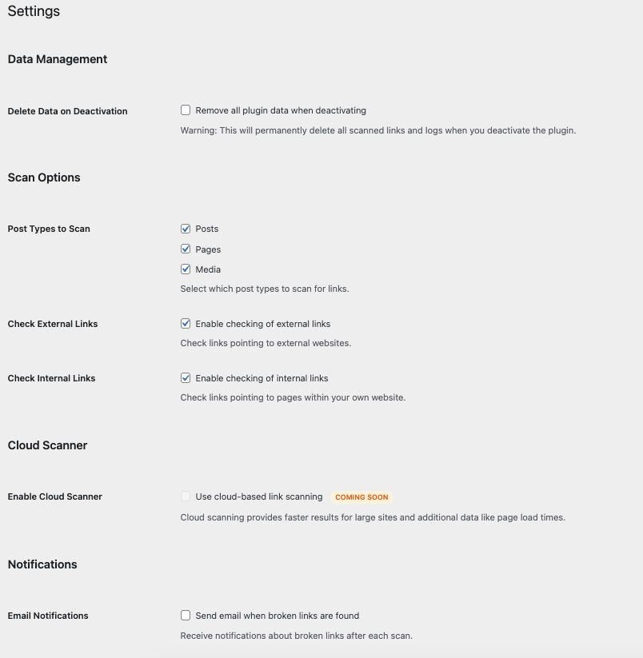
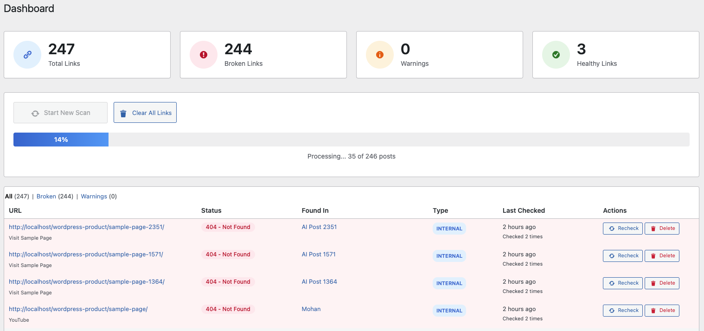

# **LinkGuardian – Advanced Broken Link Scanner for WordPress**

A fast, reliable, and lightweight broken link checker for WordPress. Scan your entire website for broken or redirected links and fix them instantly. Improve SEO, user experience, and site credibility with **LinkGuardian**.

<p align="center">
  
</p>

---

## 📌 **Table of Contents**

* [Overview](#overview)
* [Key Features](#key-features)
* [Why Choose LinkGuardian?](#why-choose-linkguardian)
* [How It Works](#how-it-works)
* [Roadmap](#roadmap)
* [Installation](#installation)
* [Configuration](#configuration)
* [FAQ](#faq)
* [Screenshots](#screenshots)
* [Changelog](#changelog)
* [Privacy Policy](#privacy-policy)
* [Support](#support)
* [Credits](#credits)

---

## 🧩 **Overview**

**LinkGuardian** is an advanced, performance-optimized WordPress plugin that scans your entire website for:

* Broken links
* Redirects
* Invalid URLs
* Timeout or unreachable resources

Broken links hurt your SEO, decrease user trust, and can impact conversions. LinkGuardian helps maintain a clean, healthy, and error-free website.

Whether you run a blog, business website, membership platform, LMS, or WooCommerce store, LinkGuardian ensures your link structure stays optimized.

---

## 🔍 **Key Features**

✔ **Full-Site Link Scanning** — posts, pages, custom post types, menus
✔ **Internal & External Link Checking**
✔ **404, Timeout & Invalid URL Detection**
✔ **Redirect Tracking (301, 302, 403, 500, etc.)**
✔ **Real-Time AJAX Scanning**
✔ **Detailed Reports of All Links**
✔ **Recheck Links Anytime**
✔ **Database Cleanup Options**
✔ **Zero Frontend Performance Impact**
✔ **Developer-Friendly Codebase**
✔ **Modern & Clean WordPress Admin UI**

---

## 🚀 **Why Choose LinkGuardian?**

Broken links affect your website:

* **SEO Rankings** – Search engines penalize sites with link errors
* **User Experience** – Dead links frustrate visitors
* **Brand Trust** – Affects credibility and professionalism
* **Conversion Rates** – Broken CTAs and buttons reduce sales

LinkGuardian helps you avoid these issues with accurate detection and easy management screens.

---

## 🛠️ **How It Works**

1. Install and activate the plugin
2. Select post types and scan settings
3. Start scanning
4. View reports for:

   * Broken links
   * Redirected links
   * Valid links
5. Fix issues directly in your content editor

---

## 🧭 **Roadmap (Coming Soon)**

* 🔄 Automated daily/weekly scans
* 📩 Email notifications
* ☁️ Cloud-based scanning
* ✏️ Bulk link editor
* 🔁 Automatic link replacement tool
* 📤 CSV export for scan results

---

## 📦 **Installation**

### **Automatic Installation**

1. Go to **Plugins → Add New**
2. Search for **LinkGuardian**
3. Click **Install Now**, then **Activate**

---

### **Manual Installation**

1. Download the plugin ZIP
2. Visit **Plugins → Add New → Upload Plugin**
3. Upload the ZIP
4. Click **Install Now** and activate the plugin

---

## ⚙️ **Configuration**

Go to:

```
LinkGuardian → Settings
```

From here, you can:

* Select which post types to scan
* Enable/disable internal/external link checking
* Configure cleanup options
* Save preferences

---

## ❓ **FAQ**

### **Will LinkGuardian slow down my site?**

No. Scans run only when initiated and use optimized background tasks.

### **Does it support scheduled scans?**

Not yet. It is coming soon.

### **Which types of links are scanned?**

* `<a>` links
* Images (``)
* Iframes (`<iframe>`)
* Scripts (`<script src="">`)
* Stylesheets (`<link href="">`)
* WordPress menu links

### **Does it delete my data?**

Only if you enable the "Delete data on uninstall" option.

### **Is it GDPR compliant?**

Yes — it does not store personal data or send data externally.

---

## 🖼️ **Screenshots**

| Screenshot | Description             |
| ---------- | ----------------------- |
| 1     | LinkGuardian Dashboard  |
| 2         | Broken Link Report  |
| 3            | Settings Page    |
| 4                 | Scan Logs   |
| 5    | Live Scan Progress View  |
          


---

## 📜 **Changelog**

### **1.0.0 – 24- Nov- 2025**

* Initial release
* Local & external link scanning
* Broken link detection
* Redirect tracking
* AJAX-powered live scanning
* Settings panel
* Scan logs
* WordPress Coding Standards compliant

---

## 🔒 **Privacy Policy**

LinkGuardian does **not** collect or share personal data.

Stored data includes only:

* Found URLs
* HTTP status codes
* Link locations
* Scan timestamps

---

## 🆘 **Support**

For help, visit:
👉 **[https://vishavjeet.in/](https://vishavjeet.in/)**

---

## 👨‍💻 **Credits**

Developed by **Vishavjeet Choubey**
Website: [https://vishavjeet.in/](https://vishavjeet.in/)
